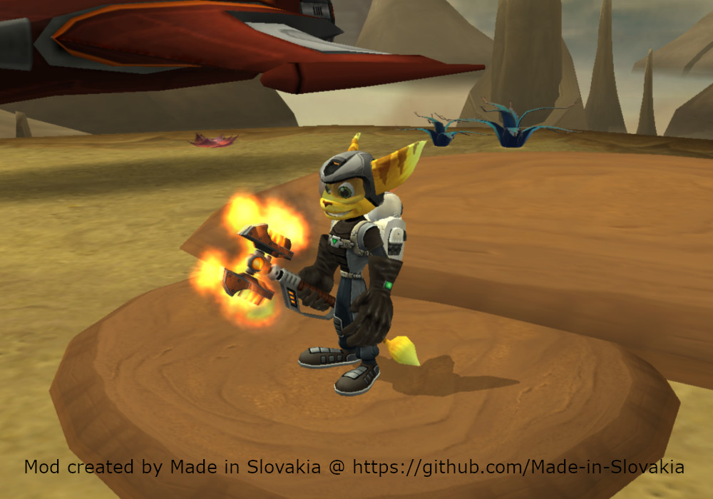

# PCSX2

My creations for [PCSX2](https://pcsx2.net) emulator.

## Disclaimer

``Use at your own risk. Regular backups are highly recommended.``

Some of these creations are experimental. They may corrupt your memory card saves and PCSX2 save states. Do not use them with your standard saves and always use new save or backup your saves before using them.

I develop and test with PAL (European) versions of the games. I try to provide NTSC (North America) versions when possible, but they still may have the note `UNTESTED` or `PARTIALLY TESTED`, which means they are not tested thoroughly. User feedback is welcome.

If you encounter any issue, please report it via [GitHub Issues](https://github.com/Made-in-Slovakia/rac/issues) or DM me on [Reddit](https://www.reddit.com/user/Made-In-Slovakia/).

## Update notifications

If you want receive notification about updates and also about new mods, you can use [Atom/RSS feed for this repository](https://github.com/Made-in-Slovakia/rac/commits/main.atom). It is standard Atom/RSS feed source and can be used with most of news reader apps.

Link to Atom/RSS feed: [https://github.com/Made-in-Slovakia/rac/commits/main.atom](https://github.com/Made-in-Slovakia/rac/commits/main.atom)

## Patches / Mods / Cheats

### How to install

Download the `pnach` file for your game version (see table bellow) and save it to the folder `pcsx2\cheats` in your user `Documents` folder. Folder is created automatically by PCSX2.

Patches/mods/cheats can be enabled/disabled from the `Cheats` page of the game properties window, and will only be applied if the `Enable Cheats` setting is enabled. This setting can be enabled globally from the `Emulation` page of the settings window, or on a per-game basis from the `Cheats` page of the game properties window (recommended).

### How to update

1. save the game to the memory card
2. turn off the game
3. update `pnach` file containing patches and mods
4. in the `Cheats` page of the game properties window, press the `Reload Cheats` button
5. start the game
6. load the game from the memory card

Do not use save states when updating mods.

#### Supported games

|Serial    |Region|Game                   |Level of support|
|----------|------|-----------------------|----------------|
|SCES-51607|PAL|Ratchet & Clank 2|Full|
|SCES-52456|PAL|Ratchet & Clank 3|Full|
|SCUS-97268|NTSC|Ratchet & Clank - Going Commando|Partial|
|SCUS-97268|NTSC|Ratchet & Clank - Going Commando (Greatest Hits)|Partial|
|SCUS-97353|NTSC|Ratchet & Clank - Up Your Arsenal|Partial|

### Combining patches / mods

Do not use multiple mods that modify the same part of the game. For example, `Helmet for skins` and `Ratchet does not need helmet` are not compatible with each other and activating both at the same time may have unexpected results.

### Ratchet & Clank 2 (Going Commando)

#### Ratchet has a small head

Shrinks Ratchet's head by `0x10`, which is just about right. If you want to shrink it more, change `3C013F50` in pnach file to `3C013F20` and reload the game from save.

`PAL version only.`

#### Old School Ratchet

Flashback to Ratchet and Clank 1 with this retro Ratchet getup.

Mod replaces `Commando Suit` and `Snow Dude` (a.k.a. Snowman) skin (avaiable in Special menu). While Commando Suit still have helmet and boots (I left them here because of Megacorp policies for safety), Snow Dude skin is replaced with Ratchet skin you know from R&C1. Because it is skin, it does not affect protection from curretly equipped armor. And do not worry, the skin is enabled even if you did not unlock it in-game.

Installation: In addition to `pnach` file, download files in `textures` folder and save them to the folder `pcsx2\textures` in your user `Documents` folder. It schould be already created by PCSX2. Then enable PCSX2 feature `Texture replacement` for Ratchet & Clank 2 game.

#### Old School Ratchet - Reloaded

Updated version of `Old School Ratchet` mod where equiped boots (gadgets) and O2 mask are shown when they are equipped or used.

### Ratchet & Clank 3 (Up Your Arsenal)

#### Armor boots fix

A collection of patches and mods related to Ratchet's boots.

`NTSC version is ONLY PARTIALLY TESTED. User feedback is welcome.`

1. Game contains a bug that causes the default boots are displayed instead of the boots for equipped armor. The bug appears after using Gravity or Charge Boots for the first time. This patch fixes that. 

2. For skins `Old School Ratchet` and `Tuxedo Ratchet`, it will display gadget boots if equipped. 
 

3. For `Infernox Armor`, it will display gadget boots if equipped. 

#### Helmet for skins

While Ratchet uses `Old School Ratchet` or `Tuxedo Ratchet` skin, he will wear a helmet and O2 mask underwater.

`NTSC version is PARTIALLY TESTED. User feedback is welcome.`

#### Ratchet does not need helmet

Removes Ratchet's helmet when he is wearing armor, except when he is underwater.

`NTSC version is PARTIALLY TESTED. User feedback is welcome.`

#### Flaming OmniWrench

Gives Ratchet's OmniWrench a flaming effect.

`NTSC version is PARTIALLY TESTED. User feedback is welcome.`

#### Old School Ratchet

Activates 'Old School Ratchet' skin.

The way the game loads Ratchet's model will cause the correct skin to not appear immediately. This is fixed when Ratchet travels between planets. This can also be done manually by scrolling through the skins, without having to activate any skin.

#### Inferno mode

Enables 'Inferno mode' with all its effects.

The way the game loads Ratchet's model will cause the correct skin to not appear immediately. This is fixed when Ratchet travels between planets. This can also be done manually by scrolling through the skins, without having to activate any skin.

### Known bugs and issues

 - Because these patches/modes/cheats use dynamic patches, which are PCSX2 only feature, it is not possible to convert them to cheat codes for a real hardware 
