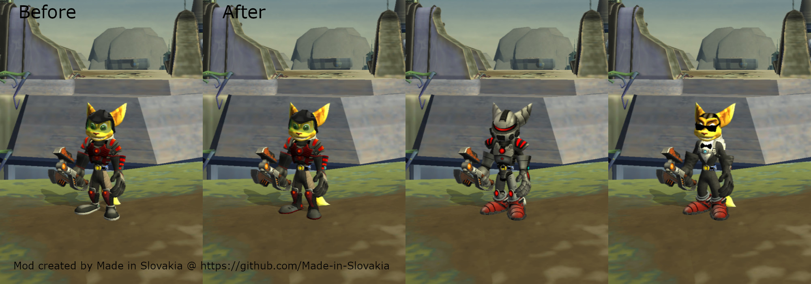
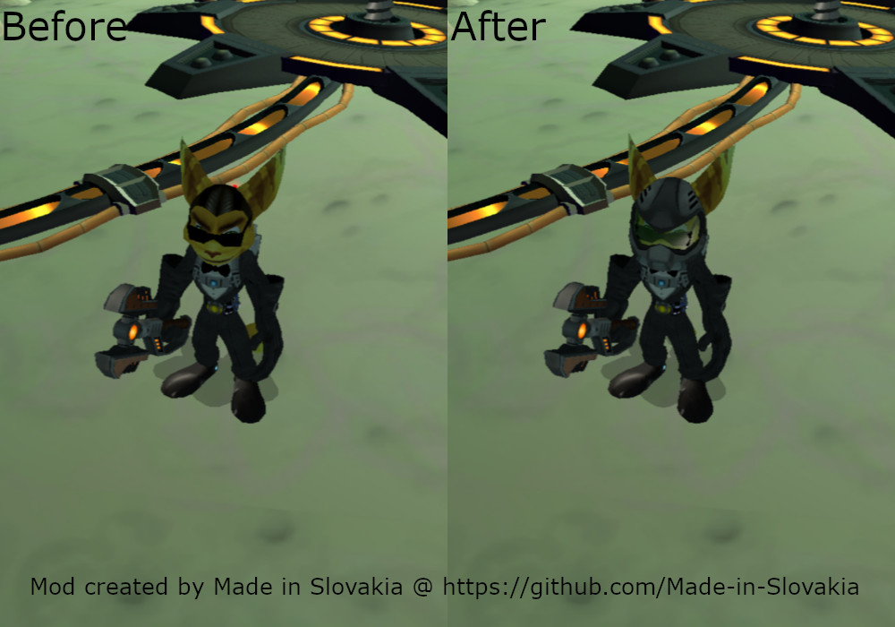

# PCSX2

My creations for [PCSX2](https://pcsx2.net) emulator.

* [Disclaimer](#disclaimer)
* [Update notifications](#update-notifications)
* [Patches](#patches)
  * [How to install](#how-to-install)
  * [How to update](#how-to-update)
  * [Supported games](#supported-games)
  * [Combining patches](#combining-patches)
  * [Ratchet & Clank](#ratchet--clank)
  * [Ratchet & Clank 2 (Going Commando)](#ratchet--clank-2-going-commando)
  * [Ratchet & Clank 3 (Up Your Arsenal)](#ratchet--clank-3-up-your-arsenal)
  * [Known bugs and issues](#known-bugs-and-issues)
* [Credits](#credits)

## Disclaimer

``Use at your own risk. Regular backups are highly recommended.``

Some of these creations are experimental. They may affect your memory card saves and PCSX2 save states. Do not use them with your standard saves and always use new save or backup your saves before using them.

``User feedback is welcome, especially for the NTSC version.``

I develop and test with PAL (European) versions of the games. I try to provide NTSC (North America) versions when possible, but they still may have the note `UNTESTED` or `PARTIALLY TESTED`, which means they are not tested thoroughly. User feedback is welcome.

If you encounter any issue, please report it via [GitHub Issues](https://github.com/Made-in-Slovakia/rac/issues) or DM me on [Reddit](https://www.reddit.com/user/Made-In-Slovakia/).

## Update notifications

If you want to receive notification about updates and also about new mods, I recommend using [Atom/RSS feed for this repository](https://github.com/Made-in-Slovakia/rac/commits/main.atom). It is standard Atom/RSS feed source and can be used with most of news reader apps.

> Link to Atom/RSS feed [https://github.com/Made-in-Slovakia/rac/commits/main.atom](https://github.com/Made-in-Slovakia/rac/commits/main.atom)

Or follow me directly on Reddit, where I post major updates as well, usually, [u/Made-In-Slovakia](https://www.reddit.com/user/Made-In-Slovakia/)

## Patches

A collection of my patches, mods and cheats for Ratchet & Clank games in the form of `pnach` files for `PCSX2`.

### How to install

Download the `pnach` file for your game version (see table bellow) from [cheats folder](cheats/) and save it to the folder `pcsx2\cheats` in your user `Documents` folder. Folder is created automatically by PCSX2.

> Alternatively, you can download the [full PCSX2 package](https://github.com/Made-in-Slovakia/rac/releases/download/latest-pcsx2/pcsx2-package.zip), which contains everything, including this documentation, from [release section](https://github.com/Made-in-Slovakia/rac/releases) of this repository. Releases are located here [https://github.com/Made-in-Slovakia/rac/releases](https://github.com/Made-in-Slovakia/rac/releases)

Patches can be enabled/disabled from the `Cheats` page of the game properties window, and will only be applied if the `Enable Cheats` setting is enabled. This setting can be enabled globally from the `Emulation` page of the settings window, or on a per-game basis from the `Cheats` page of the game properties window (recommended).

### How to update

1. save the game to the memory card
2. turn off the game
3. update `pnach` file containing patches
4. in the `Cheats` page of the game properties window, press the `Reload Cheats` button
5. start the game
6. load the game from the memory card

Do not use save states when updating mods.

### Supported games

|Serial    |CRC  |Region|Game                   |Level of support|
|----------|-----|------|-----------------------|----------------|
|SCES-51607|        |PAL|Ratchet & Clank|None|
|SCES-51607|76F724A3|PAL|Ratchet & Clank (Platinum)|Full|
|SCES-51607|2F486E6F|PAL|Ratchet & Clank 2|Full|
|SCES-52456|17125698|PAL|Ratchet & Clank 3|Full|
|SCUS-97268|CE4933D0|NTSC|Ratchet & Clank|Partial|
|SCUS-97268|38996035|NTSC|Ratchet & Clank - Going Commando|None|
|SCUS-97268|B3A71D10|NTSC|Ratchet & Clank - Going Commando (Greatest Hits)|Partial|
|SCUS-97353|45FE0CC4|NTSC|Ratchet & Clank - Up Your Arsenal|Partial|

### Combining patches

Do not use multiple patches that modify the same part of the game. For example, `Helmet for skins` and `Ratchet does not need helmet` are not compatible with each other and activating both at the same time may have unexpected results.

### Ratchet & Clank

#### Debug menu

Opens `Debug menu`. After enabling this cheat, you must deactivate it, otherwise you will not be able to leave the menu. More info about `Debug menu` on [The Cutting Room Floor](https://tcrf.net/Ratchet_%26_Clank_(PlayStation_2)/Debug_Mode) website.

#### Left handed Ratchet / Right handed Ratchet

This activates [unused cheat](https://tcrf.net/Ratchet_%26_Clank_(PlayStation_2)#Unused_Cheats) in the game that makes Ratchet hold all his weapons in his left hand. `Right handed Ratchet` will disable it.

### Ratchet & Clank 2 (Going Commando)

#### Armor boots fix

A collection of patches and mods related to Ratchet's boots.

1. Game contains a bug that causes the default boots are displayed instead of the boots for `Electrosteel Armor`. The bug appears after using Gravity or Charge Boots for the first time. This patch fixes that.
2. For `Carbonox Armor`, it will display gadget boots if equipped.
3. For skins, it will display gadget boots if equipped.

#### Helmet for skins

While Ratchet uses skin, he will wear a helmet and O2 mask under water or in space.

#### Ratchet does not need helmet

Removes Ratchet's helmet when he is wearing armor, except when he is under water or in space. Does not work with `Carbonox Armor`.

#### Old School Ratchet

Flashback to Ratchet and Clank 1 with this retro Ratchet getup.

Mod replaces `Commando Suit` and `Snow Dude` (a.k.a. Snowman) skin (avaiable in Special menu). While Commando Suit still have helmet and boots (I left them here because of Megacorp policies for safety), Snow Dude skin is replaced with Ratchet skin you know from R&C1. Because it is skin, it does not affect protection from curretly equipped armor. And do not worry, the skin is enabled even if you did not unlock it in-game.

> **Warning**, this mod will mark the `That's impossible!` skill point as earned.

**Installation:** In addition to `pnach` file, download files in `textures` folder and save them to the folder `pcsx2\textures` in your user `Documents` folder. It schould be already created by PCSX2. Then enable PCSX2 feature `Texture replacement` for Ratchet & Clank 2 game.

This mod works well with `Armor boots fix`.

#### Wildfire Boots

Enables unused and functional weapon `Wildfire Boots`. The weapon is force equipped in slot 1 in quick select wheel. Weapon does not have an icon, which makes it difficult to select. More info about unused weapons on [The Cutting Room Floor](https://tcrf.net/Ratchet_%26_Clank:_Going_Commando#Unused_Weapons) website.

``Because the weapon is experimental, it does not have animation and it is only single boot.``

#### Mine Launcher

Enables unused and functional weapon `Mine Launcher`. The weapon is force equipped in slot 2 in quick select wheel. Weapon does not have an icon, which makes it difficult to select. More info about unused weapons on [The Cutting Room Floor](https://tcrf.net/Ratchet_%26_Clank:_Going_Commando#Unused_Weapons) website.

``Because the weapon is experimental, it has no textures.``

### Ratchet & Clank 3 (Up Your Arsenal)

#### Armor boots fix

A collection of patches and mods related to Ratchet's boots.

1. Game contains a bug that causes the default boots are displayed instead of the boots for equipped armor. The bug appears after using Gravity or Charge Boots for the first time. This patch fixes that. 

2. For skins `Old School Ratchet` and `Tuxedo Ratchet`, it will display gadget boots if equipped. 
 

3. For `Infernox Armor`, it will display gadget boots if equipped. 

4. Hides gadget boots when Ratchet is in the water or under water.

#### Helmet for skins

While Ratchet uses `Old School Ratchet` or `Tuxedo Ratchet` skin, he will wear a helmet and O2 mask under water.

#### Ratchet does not need helmet

Removes Ratchet's helmet when he is wearing armor, except when he is under water. Does not work with `Infernox Armor`.

#### Flaming OmniWrench

Gives Ratchet's OmniWrench a flaming effect.

#### Old School Ratchet

Activates `Old School Ratchet` skin.

#### Inferno mode

Enables `Inferno mode` with all its effects.

While `Inferno mode` is active, many game features, such as `Hypershot`, are not available. Therefore, an active `Inferno mode` can cause a soft-lock. Disabling the cheat will disable `Inferno mode` in ~15 seconds.

``I do not support this cheat in any way. I uploaded it AS-IS and just for fun.``

#### Bomb Glove

Enables functional weapon `Bomb Glove` with full ammo (40) and refills ammo when it runs out. The weapon is force equipped in slot 5 in quick select wheel. More info about unused weapons on [The Cutting Room Floor](https://tcrf.net/Ratchet_%26_Clank:_Up_Your_Arsenal#Unused_Weapons) website.

``Because the weapon is experimental, it does not have firing animation.``

#### Sheepinator

Enables not functional weapon `Sheepinator` with full ammo (61439). The weapon is force equipped in slot 6 in quick select wheel. More info about unused weapons on [The Cutting Room Floor](https://tcrf.net/Ratchet_%26_Clank:_Up_Your_Arsenal#Unused_Weapons) website.

### Known bugs and issues

 - R&C2,R&C3: `Helmet for skins` with `Tuxedo Ratchet` skin - Ratchet's sunglasses are clipping through his helmet.
 - R&C3: `Old School Ratchet`, `Inferno mode` - the way the game loads Ratchet's model will cause the correct skin to not appear immediately. Ratchet's skin is reloaded when traveling between planets or when the player cycles through skins (without the need to activate any skin).
 - All: Patches that use dynamic patches, which are PCSX2 exclusive feature, can not be converted to cheat codes for a real hardware.

## Credits

Big thanks to the [The Cutting Room Floor](https://tcrf.net/Category:Ratchet_%26_Clank_series) website, which serves as a source of valuable information that I used in creating mods with unused content.
