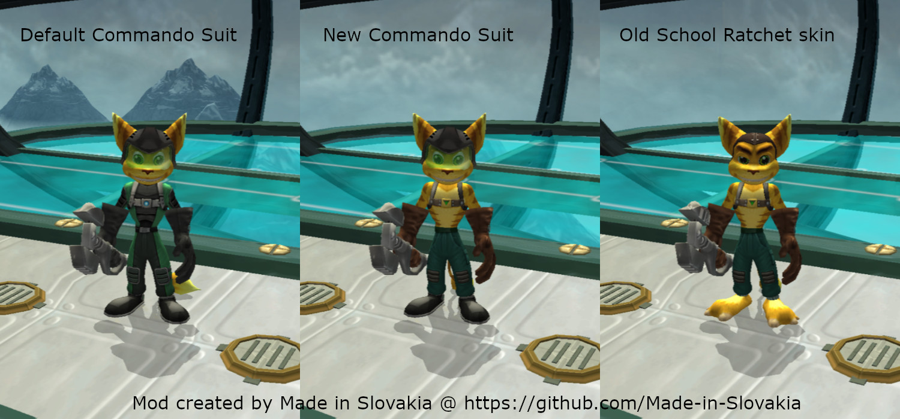
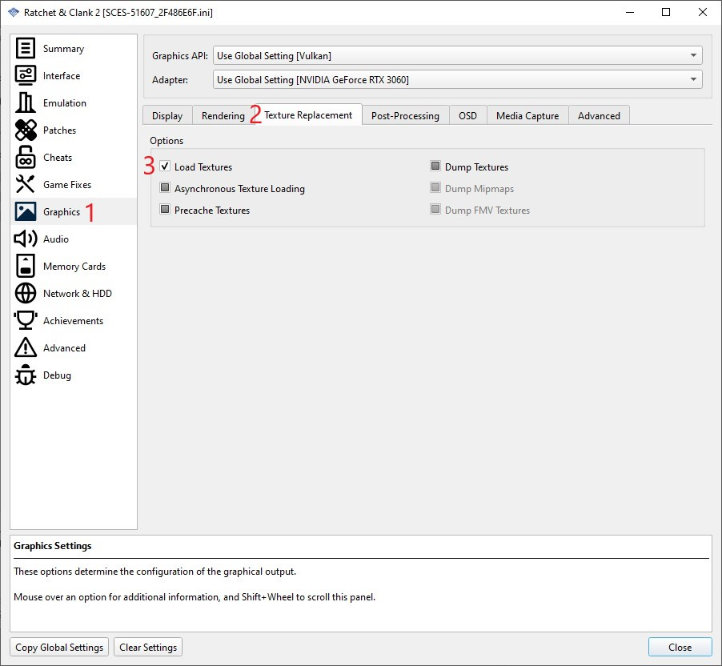
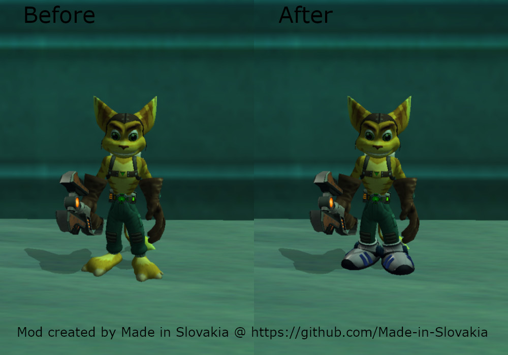
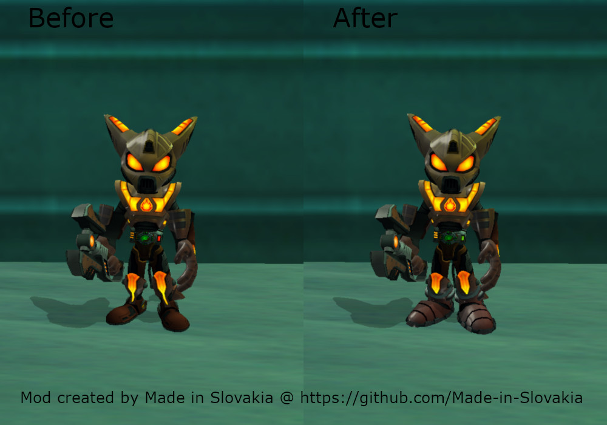
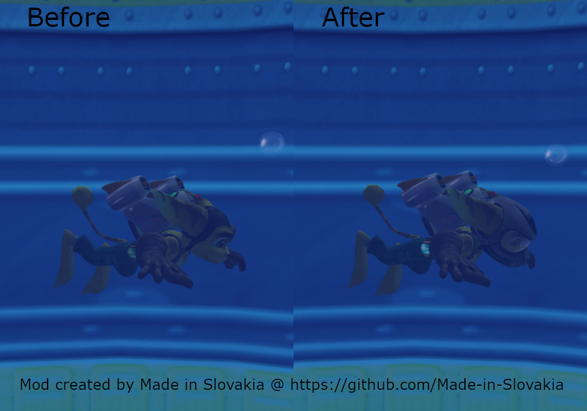
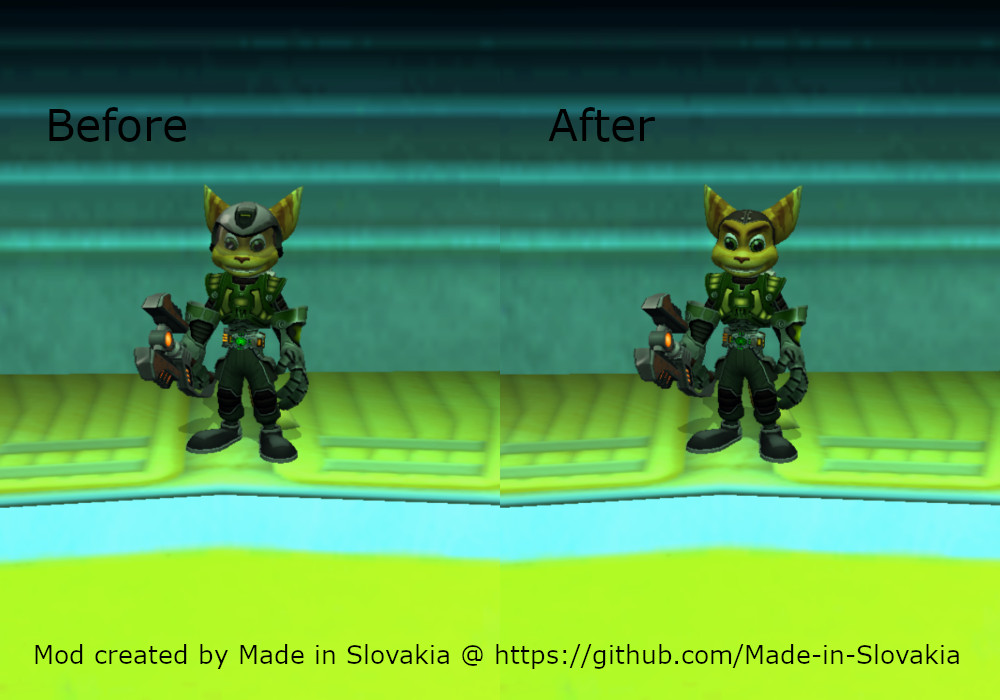

# PCSX2

My creations for [PCSX2](https://pcsx2.net) emulator.

## Disclaimer

``Use at your own risk. Regular backups are highly recommended.``

Some of these creations are experimental. They may corrupt your memory card saves and PCSX2 save states. Do not use them with your standard saves and always use new save or backup your saves before using patch/mod.

I develop and test with PAL (European) versions of the games. I try to provide NTSC (North America) versions when possible. Therefore these patches/mods may have the note `UNTESTED`, which means they are not tested thoroughly. User feedback is welcome.

If you encounter any issue, please report it via [GitHub Issues](https://github.com/Made-in-Slovakia/rac/issues) or DM me on [Reddit](https://www.reddit.com/user/Made-In-Slovakia/).

## Update notifications

If you want receive notification about updates and also about new mods, you can use [Atom/RSS feed for this repository](https://github.com/Made-in-Slovakia/rac/commits/main.atom). It is standard Atom/RSS feed source and can be used with most of news reader apps.

Link to Atom/RSS feed: [https://github.com/Made-in-Slovakia/rac/commits/main.atom](https://github.com/Made-in-Slovakia/rac/commits/main.atom)

## Patches / Mods

### How to install

Download the `pnach` file for your game version (see table bellow) and save it to the folder `pcsx2\cheats` in your user `Documents` folder. Folder is created automatically by PCSX2.

Cheats/mods can be enabled/disabled from the `Cheats` page of the game properties window, and will only be applied if the `Enable Cheats` setting is enabled. This setting can be enabled globally from the `Emulation` page of the settings window, or on a per-game basis from the `Cheats` page of the game properties window (recommended).

Activate/deactivate the patch/mod while the game is off, start the game and load the game from the memory card. **Do not use the PCSX2 save state when activating/deactivating the mod, the emulator may crash.** After the game is loaded from the memory card, it is possible to use the PCSX2 save states.

#### Supported games

|Serial    |Game                   |Level of support|
|----------|-----------------------|----------------|
|SCES-51607|Ratchet & Clank 2 (PAL)|Full|
|SCES-52456|Ratchet & Clank 3 (PAL)|Full|
|SCUS-97268|Ratchet & Clank - Going Commando (NTSC)|Partial|
|SCUS-97268|Ratchet & Clank - Going Commando (NTSC) (Greatest Hits)|Partial|
|SCUS-97353|Ratchet & Clank - Up Your Arsenal (NTSC)|Partial|

### Combining patches / mods

While some combinations such as `Boots for 'Old School Ratchet'` mod and `Armor boots fix - Reloaded` patch are highly recommended, unless explicitly allowed, do not use multiple mods that modify the same part of the game. For example, `Helmet for 'Old School Ratchet'` and `Ratchet does not need helmet` are not compatible and activating both at the same time may have unexpected consequences.

### Ratchet & Clank 2 (Going Commando)

#### Ratchet has a small head

Shrinks Ratchet's head by `0x10`, which is just about right. If you want to shrink it more, change `3C013F50` in pnach file to `3C013F20` and reload the game from save.

#### Old School Ratchet

Flashback to Ratchet and Clank 1 with this retro Ratchet getup.

Mod replaces `Commando Suit` and `Snow Dude` (a.k.a. Snowman) skin (avaiable in Special menu). While Commando Suit still have helmet and boots (I left them here because of Megacorp policies for safety), Snow Dude skin is replaced with Ratchet skin you know from R&C1. Because it is skin, it does not affect protection from curretly equipped armor. And do not worry, the skin is enabled even if you did not unlock it in-game.

Installation: In addition to `pnach` file, download files in `textures` folder and save them to the folder `pcsx2\textures` in your user `Documents` folder. It schould be already created by PCSX2. Then enable PCSX2 feature `Texture replacement` for Ratchet & Clank 2 game.

#### Old School Ratchet - Reloaded

Updated version of `Old School Ratchet` mod where equiped boots (gadgets) and O2 mask are shown when they are equipped or used.

### Ratchet & Clank 3 (Up Your Arsenal)

#### Armor boots fix

Game contains a bug that causes the default boots are displayed instead of the boots for equipped armor. The bug appears after using Gravity or Charge Boots for the first time. This mod will fix it.

This is a simplified version of `Armor boots fix - Reloaded`. Use this mod only if `Armor boots fix - Reloaded` doesn't work for you.

``Activate this fix only after acquiring Gravity or Charge Boots and equipping them at least once, otherwise the emulator will crash.``

#### Armor boots fix - Reloaded

Game contains a bug that causes the default boots are displayed instead of the boots for equipped armor. The bug appears after using Gravity or Charge Boots for the first time. This mod will fix it.

This is a more complex version of `Armor boots fix`. Use `Armor boots fix` mod if this one does not work.

#### Boots for 'Old School Ratchet' and Infernox Armor

While Ratchet uses `Old School Ratchet` skin or `Infernox Armor`, he can now visually equip gatget boots. Activating patch `Armor boots fix - Reloaded` is highly recommended.

`NTSC version is UNTESTED. User feedback is welcome.`

#### Helmet for 'Old School Ratchet'

`Old School Ratchet` will now wear a helmet and O2 mask when underwater.

`NTSC version is UNTESTED. User feedback is welcome.`

#### Ratchet does not need helmet

Removes Ratchet's helmet when he is wearing armor, except when he is underwater.

`NTSC version is UNTESTED. User feedback is welcome.`

### Known bugs and issues

 - The emulator may crash if the patch/mod is activated while the game is running (unpredictable)
 - `Helmet for 'Old School Ratchet'` does not work when Infernox Armor is equipped
