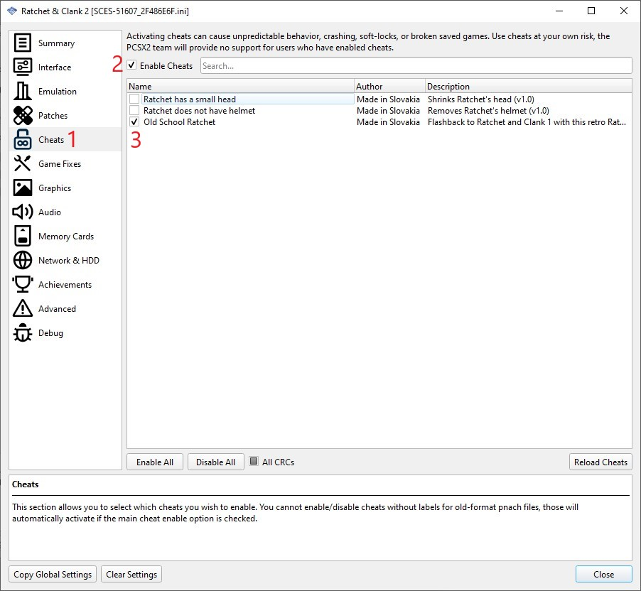

# PCSX2

My creations for [PCSX2](https://pcsx2.net) emulator.

## Disclaimer

``Use at your own risk``

Some of these are experimental. They may corrupt your saves and save states. Do not use them with your standard saves and always use new save or backup them before use.

I develop and test with PAL (European) versions of the games. I try to provide NTSC (North America) versions when possible, but they may not always work properly.

Some of these also may be marked as work in progress (WIP), see description for details.

If you encounter a issue, please report it via [GitHub Issues](https://github.com/Made-in-Slovakia/rac/issues) or DM me.

## Patches / Cheats / Mods

### How to install

Download the `pnach` file for your game version and save it to the folder `pcsx2\cheats` in your user `Documents` folder. It schould be already created by PCSX2.

Cheats/mods can be enabled/disabled from the `Cheats` page of the game properties window, and will only be applied if the `Enable Cheats` setting is enabled. This setting can be enabled globally from the `Emulation` page of the settings window, or on a per-game basis from the `Cheats` page of the game properties window (recommended).

### Ratchet & Clank 2

#### Ratchet has a small head

Shrinks Ratchet's head by `0x10`, which is just about right. If you want to shrink it more, change `3C013F50` in pnach file to `3C013F20` and reload the game from save.

#### Old School Ratchet

Flashback to Ratchet and Clank 1 with this retro Ratchet getup.

Mod replaces `Commando Suit` and `Snow Dude` (a.k.a. Snowman) skin (avaiable in Special menu). While Commando Suit still have helmet and boots (I left them here because of Megacorp policies for safety), Snow Dude skin is replaced with Ratchet skin you know from R&C1. Because it is skin, it does not affect protection from curretly equipped armor. And do not worry, the skin is enabled even if you did not unlock it in-game.

Installation: In addition to `pnach` file, download files in `textures` folder and save them to the folder `pcsx2\textures` in your user `Documents` folder. It schould be already created by PCSX2. Then enable PCSX2 feature `Texture replacement` for Ratchet & Clank 2 game.

``Disclaimer: textures are dumped/extracted from Ratchet & Clank 3 (PAL).``
