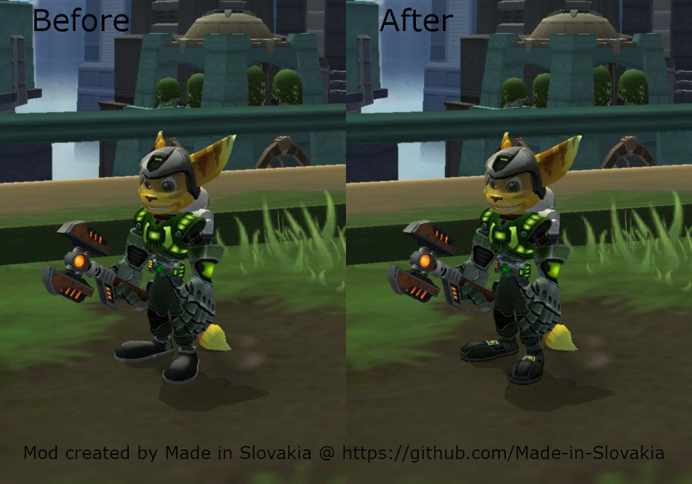

# Bugs in Ratchet & Clank

List of bugs I discovered or bugs that are not mentioned on other pages.

* [Ratchet & Clank](#ratchet--clank)
* [Ratchet & Clank 2 (Going Commando)](#ratchet--clank-2-going-commando)
* [Ratchet & Clank 3 (Up Your Arsenal)](#ratchet--clank-3-up-your-arsenal)

## Ratchet & Clank

Nothing here yet.

## Ratchet & Clank 2 (Going Commando)

### Bugged YETI (Snowbeast) counter on Greblin

Discovered by me and posted on [Reddit](https://www.reddit.com/r/RatchetAndClank/comments/1tzlfl3/is_the_problem_with_yeti_on_greblin_caused_by/).

``Discovered and tested this on the PS2 version of the game, but it is highly likely that the bug is also present in later versions of the game for PS3 and PS Vita.``

The number of spawned and aggressive YETIs on the map is limited to 4. The code that counts YETIs, however, contains a bug that causes it to miscount and over time the number of YETIs that the game can spawn increases. In one of my YETI hunts, the maximum value was 65! This causes that in some places, a very large number of YETIs spawn around Ratchet at once, they quickly surround Ratchet and only escape is death. 

YETI has several states, the following are important for our case:

* non-aggressive and YETI retreats back to hiding
* aggressive and YETI chases/attacks Ratchet

The number of aggressive YETIs is stored in memory in counter as signed integer, and if the maximum number is reached (also value stored in memory), the game does not spawn new YETIs (YETI is spawned as aggressive). Game waits until the number of aggressive YETIs decreases: Ratchet kills YETI or leave their range, which causes them to switch to a non-aggressive state.

The value of the aggressive YETI counter is incremented every time a YETI switches to an aggressive state (YETI starts chasing Ratchet or YETI jump out of hiding), there is no problem here.

The counter value is decremented in two cases:

* when the YETI goes from aggressive to non-aggressive (YETI stops chasing Ratchet or YETI jump into hiding)
* when Ratchet kills the YETI

The game code does not check whether the YETI was aggressive or not when it is killed, so when Ratchet kills a non-aggressive YETI, the counter is decremented by 2 points instead of 1 (once when the YETI goes from aggressive to non-aggressive state when he stops chasing Ratchet and once when Ratchet kills YETI). And since the value is stored as a signed integer, it can go to negative values. In one of my hunts, I was at the value -60! This subsequently causes the counter to allow a much larger number of aggressive YETIs than it should, which should be 4.

Reproduction is simple. Approach the YETI spawn point and let the game spawn 1 or 2 of them, run away until YETI stop chasing Ratchet, kill non-aggressive YETI on the retreat, which decreases number of allowed aggressive YETIs into negative number. Repeat this until you reach a larger negative number (for example -10) and the game allows spawn larger amount of YETIs at the same time.

Important fact is that the maximum number of aggressive YETIs is stored in memory too and does not change. This confirms that the behavior is unintentional, otherwise the second number expressing the maximum would be incremented.

In case you want to track the values: number of aggressive YETIs is stored at address `0x001B1D30` as 4 bytes (PAL version SCES-51607_2F486E6F) and maximum allowed number is at `0x001B1D34`.

#### Patch

I wanted to create patch for it, but game code is written in such a way that I am currently not sure if it can be fixed without major changes of game code. But I created patch for PCSX2 that at least partially mitigates this and prevents the counter from going into negative numbers.

Below is the patch for PAL (SCES-51607_2F486E6F) version of the game.

```
[Mods\Planets\Grelbin\Y.E.T.I. counter fix]
description=Mitigates problem of Y.E.T.I. counter (v1.0)
author=Made in Slovakia
patch=1,EE,E003CAFF,extended,002E335C
patch=1,EE,E002FF00,extended,301B1D30
patch=1,EE,E001FFFF,extended,001B1D32
patch=1,EE,201B1D30,extended,00000000
```

## Ratchet & Clank 3 (Up Your Arsenal)

### Armor boots bug

I first mentioned it in this [Reddit post](https://www.reddit.com/r/RatchetAndClank/comments/1rvelb8/ratchet_has_incorrect_boots_in_rc3_is_this_a_bug/).

Game contains a bug that causes the default boots (from Commando Suit) are displayed instead of the boots for equipped armor. The bug appears after using Gravity or Charge Boots for the first time. I created a patch to fix this and it is available [here](../PCSX2/README.md#armor-boots-fix-1).<br />

